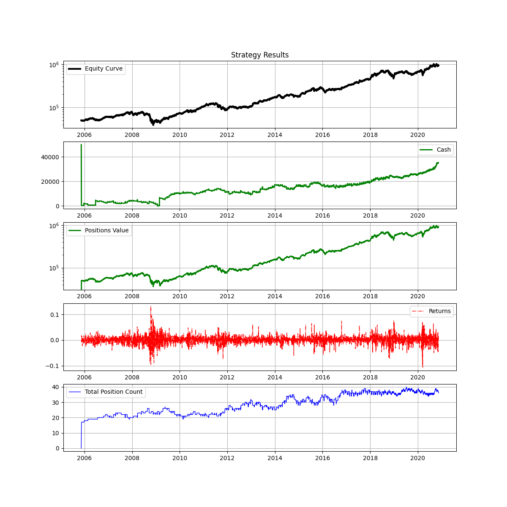

# motley-fools-backtest-with-zipline
 Backtest of the Motley Fools recommendations with Zipline

# Requirements

- Python 3.6.8
- ```pip install -r requirements.txt```

# Description

This is a backtest entirely based based on the paid Motley Fools recommendations (Rules Breakers and Stock Advisor). The general idea is to remain exposed to the recommended stocks from T0. 
The trading logic is fairly simple:
* T0: Invest the entire initial capital in their latest recommendations. Ex: $50,0000 are invested across the 25 last recommendations. 
* For each new upcoming recommendation, we buy shares for an approximate fixed amount of money (Ex: $550). If the available cash is insufficient, we close the T0 position that has been the most profitable so far. These new positions are the "rolling" positions.
* After x days following the opening of each "rolling" position (Ex: 180 days), we close it and keep the profit in cash.

# Strategy Results

* Annualized Return: 21.57%
* Max Drawdown: -51.18%
* Annualized Standard Deviation: 25.57%

``` python
INIT_CAPITAL = 50000
T0_POSITION_SIZE = 2000 # At T0 we buy for that amount of x different equities
POSITION_SIZE = 550
HOLDING_PERIOD = 180  # days
```




# Data Ingestion with Zipline

1. Add the following import instruction to the extension.py file located in : /venv/Lib/site-packages/zipline
   (You can find more information in https://www.zipline.io/bundles.html#ingesting-data-from-csv-file)
   
```python
import pandas as pd
from zipline.data.bundles import register
from zipline.data.bundles.csvdir import csvdir_equities

# EQUITIES BUNDLES

start_session = pd.Timestamp('2000-01-01', tz='utc')
end_session = pd.Timestamp('2020-11-30', tz='utc')

register(
    'us_stocks',
    csvdir_equities(
        ['daily'],
        'PROJECTPATH/data',
    ),
    calendar_name='NYSE', # US equities
    start_session=start_session,
    end_session=end_session
)
```
2. Ingest the CSV files: ```zipline ingest -b us_stocks```
   
# Execution

- Run the main.py file